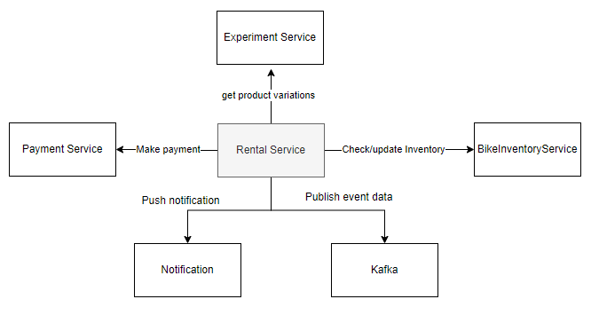
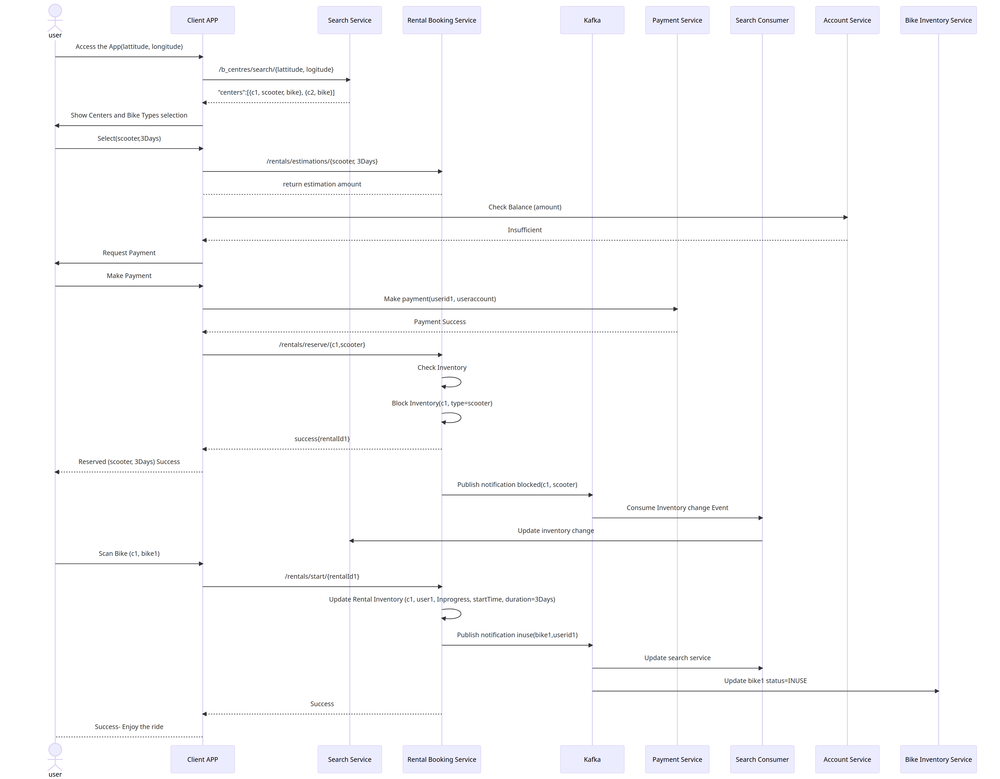

# Rental Service

The Rental Service is a system that allows users to rent bikes. It follows the hexagonal architecture pattern to separate the business logic from the infrastructure concerns.

## Architecture Overview

The system is designed using the following components:

- **RentalController**: Acts as the adapter for incoming HTTP requests related to rentals. It handles the HTTP endpoints and delegates the processing to the RentalService.

- **RentalService**: Contains the core business logic of the rental service. It interacts with the RentalRepository and EventPublisher to perform rental operations and event publishing.

- **RentalRepository**: Provides the data access layer for managing rentals. It communicates with the underlying database using Spring Data JPA.

- **EventPublisher**: Publishes events related to rental operations. It enables decoupling between components and allows for event-driven communication.

- **UnpublishedEvent**: Represents an event that could not be published successfully. It is used to store unpublished events for later processing.

## Usage

The Rental Service provides the following operations:

- `POST /rentals/{rentalId}/start`: Starts a new rental for a user.
- `POST /rentals/{rentalId}/return`: Processes the return of a rental.
- `GET /rentals/{rentalId}`: Retrieves rental details by ID.
- `GET /rentals/user/{userId}`: Retrieves rentals for a specific user.
- `GET /rentals/bike/{bikeId}/current`: Retrieves the current rental of a bike.
- `GET /rentals`: Retrieves rentals by tenant.

## Dependencies

The Rental Service has the following dependencies:

- Spring Boot: Used for creating the application and managing the dependencies.
- Spring Data JPA: Provides the data access layer for managing rentals.
- Spring Web: Enables the creation of RESTful endpoints and handling of HTTP requests.
- Other dependencies as specified in the `pom.xml` file.

## Configuration

The Rental Service requires the following configurations:

- Database: Configure the database connection details in `application.properties` file.
- Event Publisher: Configure the event publishing mechanism, such as RabbitMQ or Kafka, in `application.properties` file.

